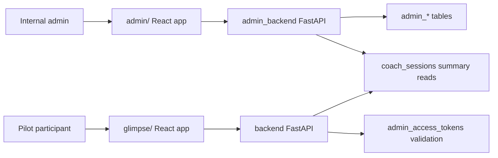

# Aether Glimpse Admin Control Panel

## Purpose

The Admin Control Panel manages enterprise pilots for Glimpse. It creates
enterprises, creates pilots, generates participant/dashboard access links,
rotates or revokes links, and shows a small pilot activity summary.
It also supports authenticated hard-delete cleanup for enterprises and pilots
so test entries or accidental entries can be removed without manual SQL.

The central design rule is separation:

- `admin/` is the separate React + TypeScript admin frontend.
- `admin_backend/` is the separate FastAPI admin backend.
- `backend/` remains the Glimpse coaching backend.
- `glimpse/` remains the Glimpse participant frontend.
- The same database instance is shared, but admin data uses separate admin
  tables.

## Runtime Architecture



## Database

Apply:

```bash
psql "$ADMIN_DATABASE_URL" -f sql/admin_control_schema.sql
```

If `ADMIN_DATABASE_URL` is not set, use the same database URL currently used by
telemetry. The schema adds:

- `admin_enterprises`
- `admin_pilots`
- `admin_access_tokens`
- `admin_audit_events`
- `coach_sessions.pilot_id`

Deleting a pilot also deletes its access tokens through the database
relationship. Deleting an enterprise deletes its pilots first, then the
enterprise. Existing telemetry rows are not deleted.

Status rules enforced by the admin backend:

- A pilot can only be deleted when its status is `closed`.
- An enterprise can only be deleted when its status is `closed`.
- When an enterprise moves from `active` to `paused`, active pilots under it
  are paused.
- When an enterprise moves from `paused` to `active`, paused pilots under it
  are activated.
- An enterprise can only be moved to `closed` when all of its pilots are
  already `closed`.

The admin backend does not auto-create or auto-migrate tables on startup.

## Environment

Use `.env.admin.example` as the template.

Required values:

- `ADMIN_API_TOKEN`
- `ADMIN_DATABASE_URL` or `TELEMETRY_DATABASE_URL`
- `GLIMPSE_ACCESS_URL_TEMPLATE`
- `DASHBOARD_ACCESS_URL_TEMPLATE`

Both URL templates must include `{token}`.

## Local Run

1. Apply the database schema:

   ```bash
   psql "$ADMIN_DATABASE_URL" -f sql/admin_control_schema.sql
   ```

2. Start the admin backend:

   ```bash
   ./run_admin_backend.sh
   ```

3. Start the admin frontend:

   ```bash
   ./run_admin_frontend.sh
   ```

4. Open:

   ```text
   http://localhost:5174
   ```

5. Enter the value of `ADMIN_API_TOKEN` in the login screen.

For one-command local development:

```bash
./run_admin_local.sh
```

## Deployment Steps

1. Provision environment variables in the admin backend service:

   ```text
   ADMIN_API_TOKEN
   ADMIN_DATABASE_URL
   GLIMPSE_ACCESS_URL_TEMPLATE
   DASHBOARD_ACCESS_URL_TEMPLATE
   ADMIN_CORS_ALLOW_ORIGINS
   ```

2. Apply `sql/admin_control_schema.sql` to the shared database.

3. Deploy the admin backend with:

   ```bash
   python -m uvicorn admin_backend.app:app --host 0.0.0.0 --port "$PORT"
   ```

4. Set `admin/.env.production` or deployment environment:

   ```text
   VITE_ADMIN_API_BASE_URL=https://your-admin-api.example.com
   ```

5. Build the admin frontend:

   ```bash
   cd admin
   npm ci
   npm run build
   ```

6. Deploy `admin/dist/` as the admin frontend.

7. Confirm:

   ```bash
   curl https://your-admin-api.example.com/admin/health
   ```

8. Log in to the admin frontend with `ADMIN_API_TOKEN`.

## Behavioural Checks

Run backend checks:

```bash
python -m unittest tests.test_admin_backend
python -m unittest tests.test_client_context
python -m unittest tests.test_telemetry_capture
python -m unittest tests.test_postgres_telemetry_sink
python admin_smoke_test.py
python smoke_test.py
```

Run frontend checks:

```bash
cd admin
npm run test
npm run build
```

Run existing Glimpse frontend checks when launch-token behaviour changes:

```bash
cd glimpse
npm run test
npm run build
```

## Future Admin Dashboard

The first admin UI includes a reserved dashboard panel. Add future dashboard
work by extending:

- `admin_backend/routes.py` for dashboard routes
- `admin_backend/service.py` for summary/reporting logic
- `admin_backend/repository.py` for SQL reads
- `admin/src/api/adminClient.ts` for frontend API calls
- `admin/src/types.ts` for response contracts
- `admin/src/App.tsx` or future dashboard components for display

Keep dashboard data filtered by `pilot_id` unless an explicit enterprise-level
dashboard is requested.
